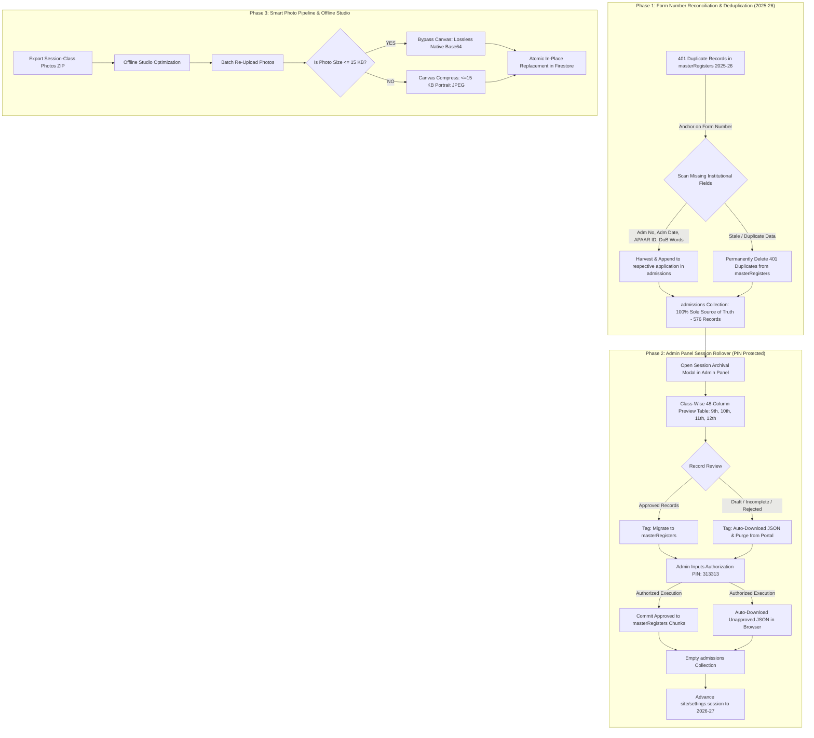

# Academic Session Rollover & Photo Management Pipeline — Implementation Plan (Version 3)

> **Institution:** Govt. Higher Secondary School Shangus  
> **Target Academic Sessions:** Current `2025-26` Rollover $\rightarrow$ `2026-27`  
> **Status:** Fully Updated with Administrative PIN (313313), Form Number Matching & Class-Wise 48-Column Preview  

---

## 1. Executive Summary & Core Architectural Principles

This document serves as the authoritative, end-to-end blueprint for Govt. Higher Secondary School Shangus for:
1. **Immediate Deduplication**: Reconciling the 401 duplicates between `masterRegisters` and `admissions` using **Form Number** as the primary anchor, harvesting missing institutional fields, and purging the 401 duplicates from `masterRegisters`.
2. **Admin-Driven Session Rollover**: Admin executes rollover directly from the Admin Panel (`SessionArchivalModal.jsx`), guarded by administrative security **PIN `313313`**, featuring a full **class-wise 48-column preview** (matching Student Records & Reports default columns), committing Approved records to `masterRegisters`, automatically downloading unapproved records as timestamped `.json`, and wiping `admissions` clean for `2026-27`.
3. **Smart Photo Management Pipeline**: Offline photo processing studio, standardized ZIP exports, and dual-collection atomic re-upload with $\le 15$ KB lossless bypass.



---

## 2. Phase 1: Overlap Reconciliation — Anchor on Form Number

### The Current State
- **`admissions`**: 576 active records for `2025-26` containing verified JKBOSE roll numbers, candidate subjects, and native compressed Base64 photos.
- **`masterRegisters`**: 401 redundant entries for `2025-26` holding legacy institutional data (`Adm. No.`, `Adm. Date`, `APAAR ID`, `DoB in words`, previous school CC/DC details).

### Resolution Protocol
1. **Matching Anchor**: Every student record will be matched strictly by **`Form Number`** (`formNo`, `Form Number`, `Form No.`).
2. **Data Harvest**:
   - Extract non-empty legacy fields from `masterRegisters` that are missing or blank in `admissions`:
     - `Adm. No.` / `Admission Number`
     - `Adm. Date` / `Admission Date`
     - `APAAR ID` / `PEN Number`
     - `DoB in words`
     - `Previous Institution CC/DC No. & Date`
     - `Previous Exam Marks, Percentage, Division`
   - Patch and enrich the active application document in `admissions`.
3. **Purge Master Register Duplicates**:
   - Permanently delete all 401 duplicate documents/chunk entries for session `2025-26` from `masterRegisters`.
4. **Verification**:
   - `masterRegisters` for session `2025-26`: Exactly **0 records**.
   - `admissions` for session `2025-26`: Exactly **576 fully enriched, verified records**.

---

## 3. Phase 2: Session Rollover Engine (Admin Panel & PIN 313313)

### Security Gate & Authorization
- The session roll action is **strictly guarded by administrative PIN `313313`**.
- The rollover button remains disabled until:
  1. The admin has reviewed the class-wise preview.
  2. The text confirmation prompt (`ARCHIVE 2025-26`) is satisfied.
  3. The 6-digit security PIN `313313` is entered and validated.

### Comprehensive Class-Wise 48-Column Preview
In [SessionArchivalModal.jsx](file:///d:/Shk_Gulfam/Projects/hss_shangus/src/portal/admin/SessionArchivalModal.jsx), replacing the basic summary table with an **interactive, class-wise 48-column data grid** (Class 9th, 10th, 11th, 12th):
- **Columns**: The 48 standard official columns (matching Student Records & Reports default columns):
  1. Form No
  2. Class Roll No
  3. Registration No
  4. Admission No
  5. Admission Date
  6. Class
  7. Stream
  8. Student Name
  9. Gender
  10. Date of Birth
  11. DoB (in words)
  12. Father's Name
  13. Mother's Name
  14. Guardian Name
  15. Category
  16. Religion
  17. Nationality
  18. Blood Group
  19. Aadhaar No
  20. APAAR ID
  21. Mobile No
  22. Alternate Mobile
  23. Email
  24. Permanent Address
  25. Tehsil
  26. District
  27. Pincode
  28. Previous School
  29. Previous Class
  30. Previous Session
  31. Previous Roll No
  32. Marks Obtained
  33. Total Marks
  34. Percentage
  35. Result
  36. Subject 1
  37. Subject 2
  38. Subject 3
  39. Subject 4
  40. Subject 5
  41. Additional Subject
  42. Bank Account No
  43. Bank Name & Branch
  44. IFSC Code
  45. Disability / CWSN
  46. Photo Status (`photo_id`)
  47. Effective Admission Status
  48. **Rollover Action** (`Commit to Master Register` vs `Download JSON & Purge`)

### Step-by-Step Rollover Execution Algorithm
1. **Partition Records**:
   - **`Approved` Cohort**: Students with confirmed `Approved` status and assigned class roll number.
   - **`Unapproved` Cohort**: Incomplete applications, drafts, rejected forms, and unapproved candidates.
2. **Commit Approved Cohort to `masterRegisters`**:
   - Pack approved students by `(Class, Stream)` into structured chunk documents (`items: [...]`) in `masterRegisters`.
   - Ensure clean canonical `photo_id` preservation ($\le 15$ KB) and remove duplicate photo fields.
3. **Auto-Download Unapproved JSON**:
   - Compile all unapproved records with their complete input fields into a standalone timestamped JSON file:
     $$\text{Filename} = \text{HSS\_Shangus\_Unapproved\_Admissions\_2025-26\_[Timestamp].json}$$
   - Trigger an immediate browser file download via `URL.createObjectURL(blob)` so the admin possesses the complete offline record.
4. **Wipe `admissions` Collection**:
   - Delete all documents in `admissions` for session `2025-26`.
   - `admissions` is now 100% empty and ready for `2026-27` applicants.
5. **Advance System Session**:
   - Update `site/settings`:
     ```json
     {
       "session": "2026-27",
       "lastArchivedSession": "2025-26",
       "lastArchivalDate": "2026-09-27T18:00:00.000Z"
     }
     ```
6. **Cache Invalidation**:
   - Invalidate Firestore client memory caches and localStorage mirrors.

---

## 4. Phase 3: Smart Photo Pipeline & Offline Studio


1. **Standardized ZIP Export**:
   - Filename convention: `[Class]_F[FormNo]_[BoardRegNo]_[StudentName]_photo.jpg`.
2. **Offline Processing**:
   - Admin optimizes photos in Photoshop/Photopea to $\le 15$ KB.
3. **Lossless Smart Ingestion**:
   - If incoming photo $\le 15$ KB: Bypass re-compression to prevent re-encoding artifacts.
   - If incoming photo $> 15$ KB: Compress using HTML5 Canvas to 300×360 px portrait $\le 15$ KB JPEG.
4. **Atomic Replacement**:
   - Replaces `photo_id` on the target record in `admissions` (if active) or `masterRegisters` (if archived).
   - Syncs `studentPhotos/photo_${regNo}` with rollback backup in `photoHistory`.

---

## 5. UI Cleanliness & Elimination of Redundant Elements

In [AdvancedReports.jsx](file:///d:/Shk_Gulfam/Projects/hss_shangus/src/portal/admin/AdvancedReports.jsx) (Database & Backup tab):
- **Merged Single Card**: Combined previously split Excel cards into a single **Institutional Master Register & Database Workbooks (.xlsx)** card.
- **Unified Filters**: Single set of dropdowns (Target Class, Academic Stream, Academic Sessions, Admission Status).
- **Scope & Column Toggles**: Direct switches for Filtered Scope vs All Records, and 48 Standard Columns vs 100+ Complete Details.
- **3 Clear Action Buttons**:
  - `Download Master Register (.xlsx)` (Amber)
  - `Download Multi-Sheet Excel (.xlsx)` (Teal)
  - `Master Backup ZIP (.zip)` (Indigo)
- **Zero Redundant Controls**: Eliminated duplicate footer buttons and trailing fragments.

---

## 6. Implementation Checklist & Execution Order

- [x] **Database & Backup Tab Cleanup**: Removed duplicate Excel card and dangling controls in `AdvancedReports.jsx`. Verified with `npm run build` (Exit Code 0).
- [ ] **Phase 1 Script**: Create `scripts/reconcile_and_purge_2025_26_duplicates.mjs` anchoring on `formNo` to harvest missing fields into `admissions` and delete the 401 duplicates from `masterRegisters`.
- [ ] **Phase 2 UI Upgrade**:
  - Enhance [SessionArchivalModal.jsx](file:///d:/Shk_Gulfam/Projects/hss_shangus/src/portal/admin/SessionArchivalModal.jsx) with PIN verification (`313313`).
  - Implement class-wise (9th, 10th, 11th, 12th) 48-column preview table showing Approved vs Unapproved disposition.
  - Implement automated Unapproved JSON download before clearing `admissions`.
- [ ] **Phase 3 Photo Seeding Upgrade**: Add $\le 15$ KB compression bypass to [seedPhotosToFirestore.js](file:///d:/Shk_Gulfam/Projects/hss_shangus/src/utils/seedPhotosToFirestore.js).
- [ ] **Build Verification**: Run `npm run build` ensuring Exit Code 0.
- [ ] **Git Stage & Commit**: `git add .` and `git commit -m "feat(archival): update session roll plan and unify admin tools UI"`.
- [ ] **Notify Admin**: Inform admin that the system is ready for manual session rollover execution and request manual `git push origin main`.
