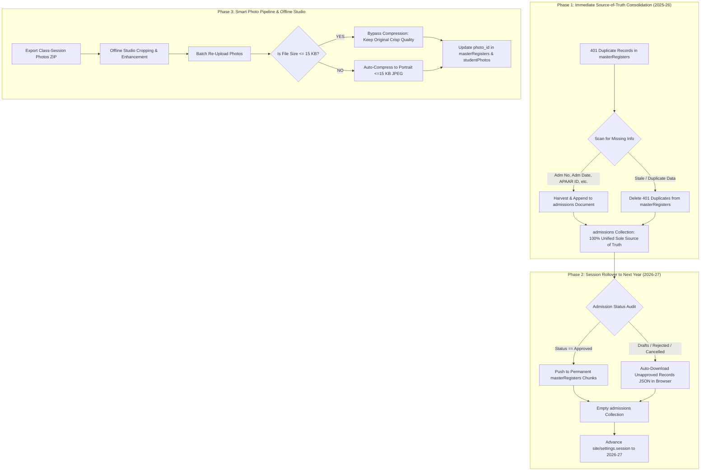
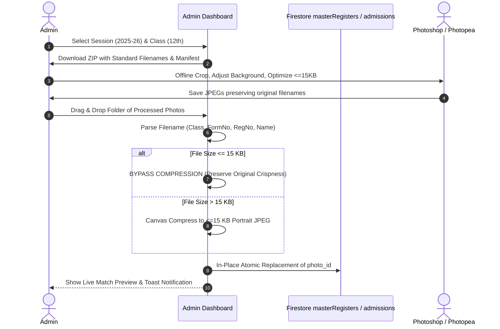

# Academic Session Rollover & Photo Management Pipeline — Implementation Plan (Revised)

> **Institution:** Govt. Higher Secondary School Shangus  
> **Target Academic Sessions:** Current `2025-26` Rollover $\rightarrow$ `2026-27`  
> **Status:** Revised per Administrative Feedback & Decisions  

---

## 1. Executive Summary & Core Architectural Principles

This revised document defines the refined blueprint for the **Academic Session Rollover ("Session Roll")** and **Batch Photo Management Pipeline** for Govt. Higher Secondary School Shangus, incorporating all administrative guidance.



### The 4 Foundation Rules
1. **`admissions` is the Sole Source of Truth for Current Session**:
   - For the current academic session (`2025-26`), the `admissions` collection acts as the **exclusive, authoritative source of truth** until the official session roll.
   - Nothing in `masterRegisters` shall override, conflict with, or split records with `admissions`.
2. **Harvest Missing Data & Delete 401 Duplicates**:
   - The 401 duplicate records in `masterRegisters` (`2025-26`) will be scanned. Any non-empty metadata fields missing from `admissions` (such as `Adm. No.`, `Adm. Date`, `APAAR ID`, `DoB (words)`, previous exam details) will be harvested and merged into their respective application documents in `admissions`.
   - Once harvested, the 401 duplicate records in `masterRegisters` will be **permanently deleted**.
   - Result: `masterRegisters` has **0 records** for `2025-26`, and `admissions` has all 576 students with complete, verified, authoritative data.
3. **Only Approved Applications Rolled to Master Register (Unapproved to Downloadable JSON)**:
   - When the session roll occurs, **only `Approved` applications** (with confirmed roll numbers) will be packed and committed to permanent `masterRegisters` chunks.
   - All non-approved applications (Drafts, Incomplete, Rejected, Cancelled) will be compiled into an automatic **`.json` file that downloads directly in the browser** for the admin's offline archive and future audit reference.
   - The `admissions` collection will then be completely wiped, leaving it 100% clean for the incoming `2026-27` cohort.
4. **Smart Photo Compression ($\le 15$ KB Bypass)**:
   - If an uploaded or re-uploaded photo is already under 15 KB (e.g. processed and optimized offline), the system will **bypass re-compression entirely**, preserving the original crispness and avoiding lossy re-encoding artifacts.
   - Canvas downscaling and compression will execute only if the source image exceeds 15 KB.

---

## 2. Current Session Overlap Resolution: Harvest & Delete

### The Situation
- `admissions`: 576 active records with JKBOSE-verified fields, subjects, roll numbers, and native compressed Base64 photos.
- `masterRegisters`: 401 historical duplicate entries with dead Google Drive photo links, pre-verification board numbers, but holding legacy institutional fields (`Adm. No.`, `Adm. Date`, `APAAR ID`, `DoB (words)`).

### Step-by-Step Resolution Workflow
```text
[masterRegisters: 401 records]
           │
           ├── 1. Match student by Form Number / Board Reg No
           │
           ├── 2. Extract unique non-empty fields missing in admissions:
           │      • Adm. No. / Adm. Date (if not already recorded in admissions)
           │      • APAAR ID / PEN Number
           │      • DoB in words
           │      • Previous Institution CC/DC No. & Date
           │      • Previous Exam Marks, Percentage, Division
           │
           ├── 3. Patch & enrich the application in admissions
           │
           └── 4. Delete the 401 duplicate documents/chunk items from masterRegisters
```

### Result After Phase 1
- **`masterRegisters`**: Contains only historical sessions (`2006` through `2024-25`). Exactly **0 records** for `2025-26`.
- **`admissions`**: Contains all 576 students for `2025-26` with complete merged data, verified JKBOSE details, and Base64 photos.
- **Immediate Benefit**: Zero confusion in reports, search lookups, ID cards, or certificate generation.

---

## 3. Session Roll Workflow (Execution Engine)

### Pre-Flight Verification Checklist
- [ ] Portal Toggle: "Admission Portal Status" switched to `Closed` in [ControlsAndSubjects.jsx](file:///d:/Shk_Gulfam/Projects/hss_shangus/src/portal/admin/ControlsAndSubjects.jsx).
- [ ] Roll Number Check: Verify all approved candidates have assigned `classRollNo`.
- [ ] Final JKBOSE Review: Confirm candidate names, parentage, and subject streams.
- [ ] Photo Check: Verify all students have valid portrait photos under `photo_id`.

### The Rollover Execution Algorithm
1. **Query Active Cohort**:
   - Fetch all records from `admissions` where `session === '2025-26'`.
2. **Partition by Status**:
   - **`Approved` Cohort**: Students with effective status `Approved` (with assigned roll numbers).
   - **`Unapproved` Cohort**: Students with status `Draft`, `Pending`, `Rejected`, or `Cancelled`.
3. **Commit Approved Cohort to `masterRegisters`**:
   - Group approved students by `(Class, Stream)`.
   - Pack into structured chunk documents (`items: [...]`) in `masterRegisters`.
   - Strip all redundant photo keys, preserving only the canonical `photo_id` ($\le 15$ KB).
4. **Auto-Generate & Download Unapproved JSON**:
   - Automatically compile all unapproved records into a timestamped JSON file:
     $$\text{Filename} = \text{HSS\_Shangus\_Unapproved\_Admissions\_2025-26\_[Timestamp].json}$$
   - Trigger an automatic browser download (`URL.createObjectURL(blob)` and `a.click()`) so the admin has the complete offline archive.
5. **Wipe `admissions` Collection**:
   - Delete all documents in `admissions` for session `2025-26`.
   - `admissions` is now 100% empty for incoming `2026-27` applicants.
6. **Advance System Pointer**:
   - In `site/settings`:
     ```json
     {
       "session": "2026-27",
       "lastArchivedSession": "2025-26",
       "lastArchivalDate": "2026-09-27T17:35:00.000Z"
     }
     ```
7. **Purge Caches**:
   - Call `clearAllMemoryCache()` and invalidate all browser caches.

---

## 4. Smart Photo Pipeline: Export, Offline Studio & Re-Upload



### 1. Batch Photo Download (ZIP)
Located in [AdvancedReports.jsx](file:///d:/Shk_Gulfam/Projects/hss_shangus/src/portal/admin/AdvancedReports.jsx):
- Filter by Academic Session (`2025-26`) and Class (`9th`, `10th`, `11th`, `12th`, or `All`).
- Standardized filename convention:
  $$\text{Filename} = \text{[Class]\_F[FormNo]\_[BoardRegNo]\_[StudentName]\_photo.jpg}$$
- Includes automated root manifest (`MANIFEST.txt`).

### 2. Offline Photo Processing
- Admin crops to standard portrait aspect ratio (300×360 px), adjusts lighting, and removes backgrounds.
- If saved directly under 15 KB in the photo editor, it enters the zero-loss pipeline upon re-upload.

### 3. Smart Batch Re-Upload & Replacement Engine
The updated photo seeding service ([seedPhotosToFirestore.js](file:///d:/Shk_Gulfam/Projects/hss_shangus/src/utils/seedPhotosToFirestore.js)):
1. **Filename Extraction**: [parsePhotoFilename](file:///d:/Shk_Gulfam/Projects/hss_shangus/src/utils/imageCompressor.js#L78) parses `regNo`, `formNo`, `rollNo`, `class`, and `session`.
2. **Dual-Collection Matcher**: Locates the student in `admissions` (during active session) or `masterRegisters` (after rollover).
3. **Smart Compression Decision**:
   ```javascript
   let dataUrl;
   if (file.size <= 15 * 1024) {
     // File is already <= 15 KB: Convert directly to Base64 without re-compressing
     dataUrl = await fileToDataUrl(file);
   } else {
     // File exceeds 15 KB: Auto-compress using in-browser canvas
     dataUrl = await compressStudentPhoto(file, 300, 360, 0.75);
   }
   ```
4. **Atomic Replacement**:
   - Replaces `photo_id` on the student record in Firestore.
   - Synchronizes `studentPhotos/photo_${regNo}` and appends old photo to `photoHistory` array for rollback safety.
   - Purges all deprecated legacy keys (`Student Photo`, `photoUrl`, `photoId`, etc.).
5. **Activity Logging**: Logs the event in [adminActivityLogger.js](file:///d:/Shk_Gulfam/Projects/hss_shangus/src/services/adminActivityLogger.js).

---

## 5. Concrete Execution Checklist

### Phase 1: Reconcile & Purge 2025-26 Master Register Duplicates
- [ ] Create executable script `scripts/reconcile_and_purge_2025_26_duplicates.mjs`.
- [ ] Dry-Run: Log every missing field harvested from `masterRegisters` into `admissions` (e.g. `Adm. No.`, `Adm. Date`, `APAAR ID`).
- [ ] Commit: Update `admissions` records with the harvested fields.
- [ ] Delete: Permanently delete the 401 duplicate records from `masterRegisters`.
- [ ] Verify: Confirm `masterRegisters` count for `2025-26` is 0, and `admissions` count is 576.

### Phase 2: Session Roll Engine Upgrade
- [ ] Update [sessionArchivalService.js](file:///d:/Shk_Gulfam/Projects/hss_shangus/src/services/sessionArchivalService.js):
  - Ensure only `Approved` status records are archived to `masterRegisters`.
  - Compile unapproved records into downloadable JSON payload.
  - Trigger automatic browser download of unapproved records JSON.
  - Wipe `admissions` collection.
  - Advance `site/settings.session` to `2026-27`.
- [ ] Update [SessionArchivalModal.jsx](file:///d:/Shk_Gulfam/Projects/hss_shangus/src/portal/admin/SessionArchivalModal.jsx) UI with progress breakdown (Approved to Master, Unapproved to JSON, Clean Slate).

### Phase 3: Smart Photo Seeding & Replacement Suite
- [ ] Update [seedPhotosToFirestore.js](file:///d:/Shk_Gulfam/Projects/hss_shangus/src/utils/seedPhotosToFirestore.js):
  - Add $\le 15$ KB compression bypass.
  - Support updating both `admissions` and chunked `masterRegisters`.
- [ ] Add "Batch Photo Replacement" modal in [ControlsAndSubjects.jsx](file:///d:/Shk_Gulfam/Projects/hss_shangus/src/portal/admin/ControlsAndSubjects.jsx).

### Phase 4: Local Build & Git Verification
- [ ] Run `npm run build` and ensure Exit Code 0.
- [ ] Stage all changes: `git add .`.
- [ ] Commit locally: `git commit -m "feat(archival): implement revised session roll and smart photo replacement pipeline"`.
- [ ] Inform admin for manual `git push origin main`.
