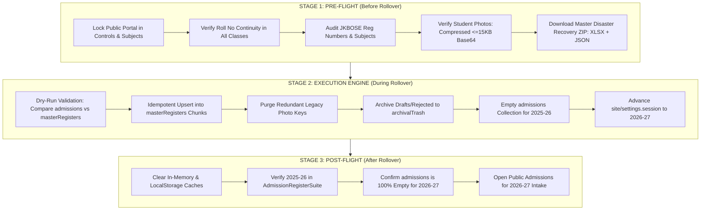
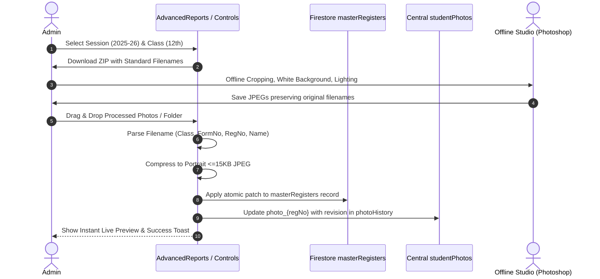

# Academic Session Rollover & Photo Management Pipeline — Implementation Plan

> **Institution:** Govt. Higher Secondary School Shangus  
> **Target Academic Sessions:** Current `2025-26` Rollover $\rightarrow$ `2026-27`  
> **Status:** Draft for Administrative Review & Feedback  

---

## 1. Executive Summary & Core Principles

This document defines the architectural blueprint and operational roadmap for executing the **Academic Session Rollover ("Session Roll")** and establishing a **Batch Photo Management Pipeline** for Govt. Higher Secondary School Shangus.

### Core Architectural Guarantees
1. **Single Source of Truth**:
   - **Active Session (`admissions`)**: Transient staging collection for the current active cycle (`2025-26`). All student intake, document uploads, roll allocations, and JKBOSE syncs occur here.
   - **Permanent Ledger (`masterRegisters`)**: Authoritative institutional archive (2006 to present) organized in partitioned chunks (`chunk_001`–`chunk_123`). Authoritative source for Transfer Certificates (TC), Provisional Certificates, Character Certificates, Gazettes, and result verification.
2. **Zero-Duplicate Rule**:
   - **Compound Identity**: No student shall exist more than once for any unique combination:
     $$\text{Unique Identity} = (\text{Board Reg No} \lor \text{Form No}) + \text{Session} + \text{Class}$$
   - **No Cross-Collection Duplication**: Once a session is rolled over, `admissions` is wiped 100% clean for that session.
   - **No Document-Level Photo Duplication**: Only one photo attribute (`photo_id`) is retained per student record (compressed portrait JPEG $\le 15$ KB). All redundant legacy keys (`Student Photo`, `photoUrl`, `photoId`, etc.) are purged.
3. **Admin Photo Management Pipeline**:
   - Admin inspects applications with both text and compressed photos.
   - Direct batch download of photos filtered by **Session** and **Class** in a `.zip` archive with deterministic filenames.
   - Admin edits/crops photos offline in external software (Photoshop/Photopea).
   - Secure drag-and-drop batch re-upload engine automatically matches students by filename, compresses to $\le 15$ KB, and replaces records in `masterRegisters` and `studentPhotos` with full revision history.

---

## 2. Current Session (2025-26) Overlap Diagnosis

### The Reality in the Database
An audit of Cloud Firestore and the official institutional database reveals:
- **`source_data` / `masterRegisters`**: Contains **401 student records** under session `2025-26` (Class 11th and 12th).
  - *Data state*: Contains pre-verification registration numbers and **inaccessible Google Drive photo URLs** (`https://drive.google.com/file/...`).
- **`admissions`**: Contains **576 active records** for session `2025-26`.
  - *Data state*: Contains all 401 students from the master register plus **175 newer admissions** (Classes 9th, 10th, and later entrants).
  - *Authoritative updates*: You recently updated and verified these records against official JKBOSE award lists (registration numbers, subjects, names) and attached native Base64 compressed photos.

### What Happens on a Blind Rollover?
| Risk | What Occurs Without Pre-Reconciliation | Consequence |
| :--- | :--- | :--- |
| **Double Entries** | Appending `admissions` to `masterRegisters` creates 401 duplicates. | Search index, TC generator, and certificate studio report duplicate student records. |
| **Data Regression** | Stale chunk records in `masterRegisters` take precedence over verified `admissions`. | JKBOSE-verified registration numbers, names, and subjects are hidden by unverified older records. |
| **Broken Images** | Historical master records point to dead Google Drive links. | Photo gallery, ID cards, and admission registers display broken images. |
| **Storage Waste** | Redundant base64 strings and duplicate records stored in Firestore. | Doubles memory cache footprint and billable Firestore document reads. |

### The Reconciliation Solution
Before advancing the session pointer, an **Idempotent Reconciliation Script** will execute:
1. Match each student in `admissions` against existing `masterRegisters` chunks using `(Session: '2025-26', Class, BoardRegNo || FormNo)`.
2. **For the 401 matching students**: Overwrite the master register entry with the JKBOSE-verified fields (names, board Reg No, subjects) and clean compressed Base64 `photo_id`, completely deleting dead Drive links.
3. **For the 175 new students**: Append them into the appropriate `2025-26` class/stream master register chunks.
4. **Empty `admissions`**: Wipe the `2025-26` records from `admissions`, leaving the collection ready for `2026-27`.

---

## 3. The 3-Stage Rollover Lifecycle



### Stage 1: Before Session Roll (Checklist)
- [ ] **Portal Lock**: Toggle "Admission Portal Status" to `Closed` in [ControlsAndSubjects.jsx](file:///d:/Shk_Gulfam/Projects/hss_shangus/src/portal/admin/ControlsAndSubjects.jsx).
- [ ] **Roll Number Audit**: Ensure every approved student has a contiguous `classRollNo` without duplicates or missing slots.
- [ ] **JKBOSE Audit**: Confirm that board registration numbers (`boardRegNo`) are 100% filled for Class 10th, 11th, and 12th.
- [ ] **Photo Validation**: Confirm that all admitted students have compressed photographs under `photo_id`.
- [ ] **Disaster Recovery Backup**: Download the all-in-one backup archive (`.xlsx` + `.json`) from [AdvancedReports.jsx](file:///d:/Shk_Gulfam/Projects/hss_shangus/src/portal/admin/AdvancedReports.jsx).

### Stage 2: Rollover Execution Engine
1. **Idempotent Merge**: Update matching records and insert missing records into `masterRegisters` chunks.
2. **Schema Sanitization**:
   ```javascript
   // Ensure only single canonical photo field exists
   record.photo_id = cleanCompressedBase64;
   delete record['Student Photo'];
   delete record['Student Photograph'];
   delete record['photoUrl'];
   delete record['photoId'];
   delete record['photo'];
   delete record['photoData'];
   ```
3. **Empty Active Collection**:
   - Soft-delete or permanently wipe all documents in `admissions` for session `2025-26`.
4. **Advance Global Pointer**:
   - In `site/settings`:
     ```json
     {
       "session": "2026-27",
       "lastArchivedSession": "2025-26",
       "lastArchivalDate": "2026-09-27T17:30:00.000Z"
     }
     ```

### Stage 3: After Session Roll
- [ ] **Cache Purge**: Ensure `clearAllMemoryCache()` and `invalidateCache('admissions')` fire.
- [ ] **Ledger Inspection**: Open [AdmissionRegisterSuite.jsx](file:///d:/Shk_Gulfam/Projects/hss_shangus/src/portal/admin/AdmissionRegisterSuite.jsx) and verify all 576 students under `2025-26`.
- [ ] **Intake Verification**: Verify that the student application form opens cleanly for `2026-27` with 0 legacy records displayed.

---

## 4. Student Photo Management Pipeline



### 1. Batch Photo Download (ZIP Generation)
Located in [AdvancedReports.jsx](file:///d:/Shk_Gulfam/Projects/hss_shangus/src/portal/admin/AdvancedReports.jsx):
- **Filters**: Academic Session (e.g., `2025-26`) and Class (`9th`, `10th`, `11th`, `12th`, or `All`).
- **Standardized Filename Format**:
  $$\text{Filename} = \text{[Class]\_F[FormNo]\_[BoardRegNo]\_[StudentName]\_photo.jpg}$$
  *Example*: `12th_F250176_2401003000470030_Umais_Manzoor_photo.jpg`
- **Embedded Manifest**: An automatic `MANIFEST.txt` is packed into the root of the ZIP detailing total exported photos, roll numbers, and missing records.

### 2. Offline Photo Processing
- The admin edits photos offline using external graphic design tools (Photoshop, Photopea, Lightroom).
- The admin standardizes aspect ratio (portrait 300×360 px) and removes cluttered backgrounds.
- **Rule**: Filename must remain intact (or at least retain the `F250176` or Board Registration Number token).

### 3. Smart Batch Re-Upload & Replacement Engine
The updated photo seeding service ([seedPhotosToFirestore.js](file:///d:/Shk_Gulfam/Projects/hss_shangus/src/utils/seedPhotosToFirestore.js)):
1. **Filename Extraction**: [parsePhotoFilename](file:///d:/Shk_Gulfam/Projects/hss_shangus/src/utils/imageCompressor.js#L78) reads the file name and extracts `regNo`, `formNo`, `rollNo`, `class`, and `session`.
2. **Dual-Collection Matching**: Uses [recordLocator](file:///d:/Shk_Gulfam/Projects/hss_shangus/src/utils/recordIdentity.js#L88) to locate the student in either `admissions` (if active) or `masterRegisters` (if archived in a chunk).
3. **Canvas Auto-Compression**: Compresses incoming files to $\le 15$ KB JPEG ceiling using [compressStudentPhoto](file:///d:/Shk_Gulfam/Projects/hss_shangus/src/utils/imageCompressor.js#L5).
4. **Atomic Replacement**:
   - Updates `photo_id` on the student record in `masterRegisters` via [applyRecordPatch](file:///d:/Shk_Gulfam/Projects/hss_shangus/src/services/recordMutationService.js#L44).
   - Updates `studentPhotos/photo_${regNo}` and appends the old image to `photoHistory` for rollback safety.
   - Cleans all legacy photo fields (`Student Photo`, `photoUrl`, etc.).
5. **Audit Trail**: Logs the update in [adminActivityLogger.js](file:///d:/Shk_Gulfam/Projects/hss_shangus/src/services/adminActivityLogger.js).

---

## 5. Phased Implementation Roadmap

### Phase 1: Current Session Reconciliation & Deduplication Script
- [ ] Create `scripts/reconcile_2025_26_session.mjs`.
- [ ] Run dry-run to identify exact field differences between `admissions` (576) and `masterRegisters` (401).
- [ ] Execute atomic merge: update the 401 existing records with JKBOSE-verified fields and compressed photos, and append the 175 new records into the master register.
- [ ] Purge all dead Google Drive links and redundant photo keys.

### Phase 2: Rollover Engine Upgrade
- [ ] Update [sessionArchivalService.js](file:///d:/Shk_Gulfam/Projects/hss_shangus/src/services/sessionArchivalService.js) to write directly into chunked `masterRegisters` structures rather than creating flat documents.
- [ ] Update [SessionArchivalModal.jsx](file:///d:/Shk_Gulfam/Projects/hss_shangus/src/portal/admin/SessionArchivalModal.jsx) with a multi-step inspection preview:
  - Step 1: Record & Photo Integrity Audit.
  - Step 2: Idempotent Merge Preview.
  - Step 3: Wiping `admissions` & advancing session pointer.

### Phase 3: Batch Photo Re-Upload UI & Service
- [ ] Upgrade [seedPhotosToFirestore.js](file:///d:/Shk_Gulfam/Projects/hss_shangus/src/utils/seedPhotosToFirestore.js) to support updating archived `masterRegisters` chunk documents.
- [ ] Add a dedicated "Batch Photo Replacement" modal in [ControlsAndSubjects.jsx](file:///d:/Shk_Gulfam/Projects/hss_shangus/src/portal/admin/ControlsAndSubjects.jsx) with a drag-and-drop dropzone, live matched preview, and one-click commit.

### Phase 4: Local Build & Git Workflow Compliance
- [ ] Run `npm run build` to verify zero breaking errors and Exit Code 0.
- [ ] Stage all verified changes: `git add .`.
- [ ] Commit locally with descriptive message: `git commit -m "feat(archival): implement session roll reconciliation and batch photo pipeline"`.
- [ ] Notify admin for manual `git push origin main`.

---

## 6. Administrative Feedback & Decisions Required

Please review the following decisions and let me know your preferences:

1. **Purging of 2025-26 Admissions Collection**:
   - *Option A (Recommended)*: Permanently delete 2025-26 records from `admissions` once safely merged into `masterRegisters`, leaving `admissions` 100% blank for 2026-27 intake.
   - *Option B*: Soft-delete by setting `_deleted: true, status: 'Archived'` in `admissions` so they are hidden from active queries.
2. **Drafts & Incomplete Applications**:
   - Purge incomplete drafts permanently, or move them into the `archivalTrash` / Recycle Bin collection?
3. **Photo Re-Upload Destination**:
   - When new photos are uploaded for past students, should the system preserve the previous photo in a `photoHistory` rollback array inside `studentPhotos`? (Recommended: Yes).
